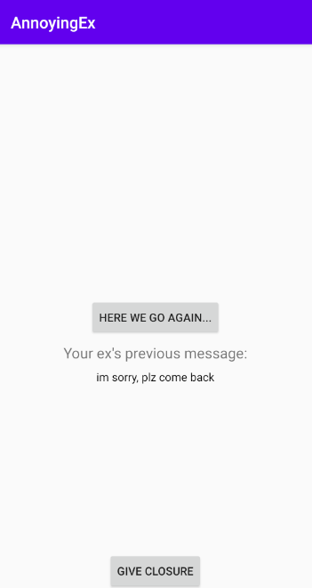

# AnnoyingEx
This is an Kotlin assignment written for UW course INFO 448.

Author: Wayne Li

## Homework 5 - Background Tasks & Notifications

Implemented an app that would fetch you the most annoying EX messages and haunt you once you clicked the "Here we go again" button,
the annoying notifications will appear every 20 minutes when your device is charging, so you can have the best sleep at night while charging your phone ;)

The only thing you can do is to give closure and never go back.

Additionally, I implemented the following extra credit features:
1. When you click on the message notification, it would launch the app, and display the past message on the screen.
2. There is another work that fetches new messages from JSON every 2 days when the device's battery is not too low and is connected to a network.

Here is the notification preview:

Here is the main activity preview (after clicking the notification):

